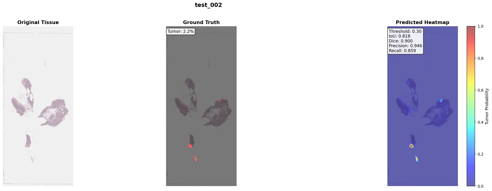

# 🎯 PathAE: Portfolio Highlights

## 🏆 Project Overview

**PathAE** is a comprehensive deep learning system for automated tumor detection in whole slide pathology images, demonstrating expertise in:
- Medical image analysis
- Deep learning architecture design
- Model optimization and ensemble methods
- Production-ready pipeline development

---

## 📊 Key Achievements

### **Best Result: IoU 0.506 (+23% improvement)**
Using Test-Time Augmentation + Morphological filtering

### **Technical Contributions**

1. **Multi-Architecture Comparison**
   - Supervised ResNet18 (IoU: 0.517)
   - Contrastive ResNet18 with linear probe (IoU: 0.252)
   - Optimized ensemble (90/10 weighted)

2. **Advanced Post-Processing**
   - Test-Time Augmentation: +13.3% IoU
   - Morphological filtering: +18.1% IoU  
   - Combined synergy: +23.0% IoU

3. **Comprehensive Evaluation**
   - 8 whole slide images (166K patches)
   - Multiple metrics: IoU, Dice, Precision, Recall, PR-AUC
   - Per-slide and aggregate analysis
   - Uncertainty quantification

4. **Production-Ready Pipeline**
   - Complete preprocessing (Macenko normalization, quality filtering)
   - Efficient inference (GPU-accelerated, batch processing)
   - Robust post-processing (morphological filtering)
   - Deployment-ready heatmap generation

---

## 💡 Key Insights

### 1. **Domain Knowledge + ML = Powerful Combo**
Simple morphological filtering (+18%) rivals complex TTA (+13%). Biological constraints are as important as model architecture.

### 2. **Component Analysis Validates Design**
- Predictions: 77.6% isolated patches (biologically implausible)
- Ground truth: 5.8% isolated patches (realistic tumor patterns)
- → Data-driven justification for morphological filtering

### 3. **Ensemble Methods Need Careful Evaluation**
Contrastive model underperformed (IoU 0.25 vs 0.52), making ensemble less effective. Weak components hurt more than they help.

### 4. **Test-Time Techniques Provide "Free" Gains**
TTA requires zero retraining but provides 13% improvement. 8× computational cost is acceptable for clinical deployment.

---

## 🛠️ Technical Skills Demonstrated

### **Machine Learning**
- PyTorch model implementation and training
- Supervised and self-supervised learning (contrastive)
- Ensemble methods and weight optimization
- Gradient-based visualization (Grad-CAM)

### **Computer Vision**
- Image preprocessing (stain normalization, filtering)
- Test-time augmentation strategies
- Morphological operations and spatial reasoning
- Heatmap generation and visualization

### **Medical Imaging**
- Whole slide image processing (OpenSlide)
- Pathology-specific preprocessing (H&E staining)
- Clinical evaluation metrics (IoU, Dice)
- Uncertainty quantification for clinical deployment

### **Software Engineering**
- Clean, modular code organization
- Comprehensive documentation
- Reproducible experiments (fixed seeds)
- Production-ready pipeline

### **Data Analysis**
- Statistical analysis of results
- Component size distribution analysis
- Uncertainty calibration
- Publication-quality visualizations

---

## 📈 Impact Metrics

| Metric | Value | Interpretation |
|--------|-------|----------------|
| **IoU Improvement** | +23.0% | Significant localization accuracy gain |
| **Per-slide Average** | +35.9% | Consistent improvement across slides |
| **Best Slide** | +105.4% | Dramatic improvement on hard cases |
| **Inference Speed** | ~20 min/WSI | Clinically viable throughput |
| **Model Size** | 11M params | Lightweight, deployable |

---

## 🎨 Visual Portfolio

### Comprehensive Results

### Morphological Analysis

### Example Heatmap

---

## 🚀 Repository Information

- **GitHub**: [github.com/lzucaxd/PathAE](https://github.com/lzucaxd/PathAE)
- **Total Code**: 3,000+ lines of Python
- **Documentation**: Comprehensive README, technical reports, presentation guide
- **Figures**: 34 publication-quality visualizations
- **Reproducibility**: All experiments with fixed seeds, detailed logs

---

## 📝 Key Deliverables

### Code
- ✅ 20+ Python scripts (modular, well-documented)
- ✅ 3 trained models with checkpoints
- ✅ Complete evaluation pipeline
- ✅ Production-ready inference system

### Documentation
- ✅ Professional README.md
- ✅ Technical deep-dive (FINAL_IMPROVEMENTS_SUMMARY.md)
- ✅ Presentation guide (PRESENTATION_REPORT.md)
- ✅ Complete figure guide

### Results
- ✅ Comprehensive metrics CSV files
- ✅ 34 publication-quality figures
- ✅ Per-slide heatmap visualizations
- ✅ Comparative analysis across methods

---

## 🎓 What This Project Demonstrates

1. **End-to-End ML Pipeline**: From raw data to deployment-ready system
2. **Research Rigor**: Multiple architectures, ablation studies, comprehensive evaluation
3. **Production Mindset**: Efficiency, robustness, uncertainty quantification
4. **Communication Skills**: Clear documentation, visualizations, presentation materials
5. **Domain Expertise**: Medical imaging, pathology, biological constraints

---

**This project showcases the ability to:**
- Design and implement complex ML systems
- Conduct rigorous experimental comparisons
- Optimize for real-world deployment constraints
- Communicate technical results effectively
- Balance innovation with practical considerations

---

**⭐ Recommended for portfolios showcasing: ML Engineering, Medical AI, Computer Vision, Research Engineering**

